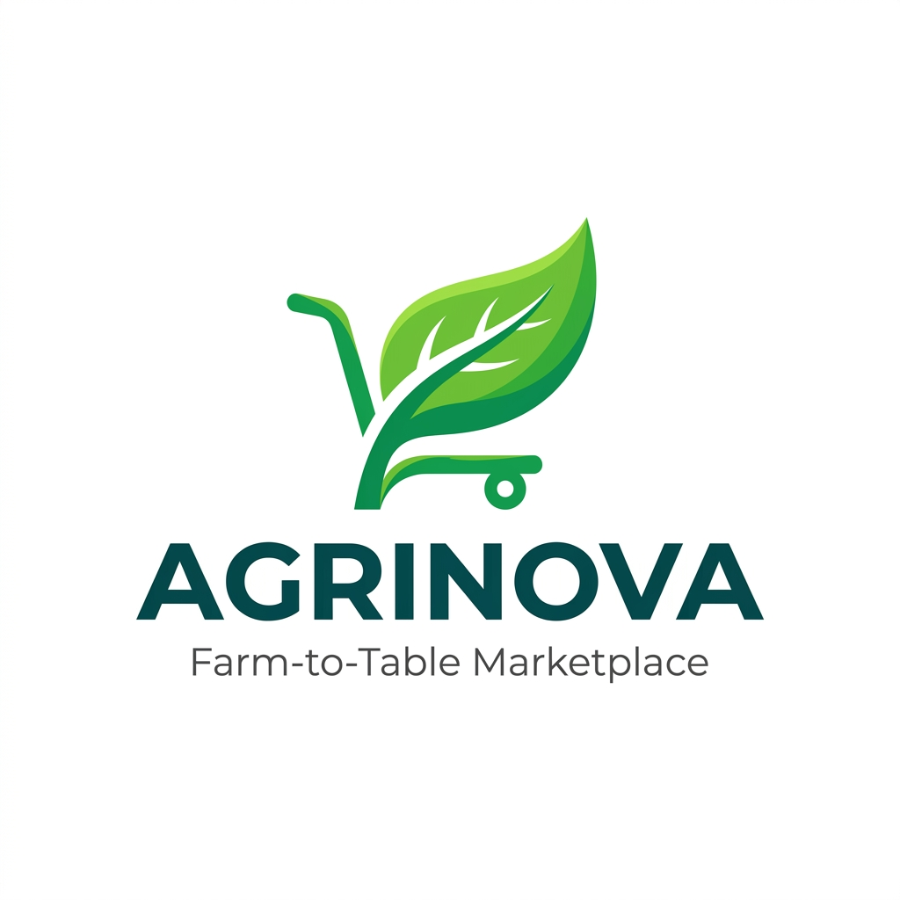

<div align="center">
  

  <h1>🌾 AgriNova</h1>
  <p><strong>AI-Powered Farm-to-Table Marketplace</strong></p>
  <p><em>Connecting Indian Farmers to Consumers — Intelligently.</em></p>

  <p>
    <a href="http://16.171.255.47" target="_blank"></a>
    <a href="http://16.171.255.47.nip.io/" target="_blank"></a>
    <a href="https://github.com/DILJEETSINGH07/AgriNova" target="_blank"></a>
  </p>

  <p>
    
    
    
    
    
    
    
  </p>
</div>

---

## 📖 About AgriNova

**AgriNova** is a full-stack, AI-powered agricultural e-commerce platform designed to eliminate the middleman and directly bridge the gap between **Indian farmers** and **end consumers**. Beyond a marketplace, AgriNova features an intelligent AI farming assistant, a real-time WebSocket messaging system, interactive map-based product discovery, and a fully automated CI/CD deployment pipeline on AWS.

> Built as a Final Year B.Tech Computer Science Project (2025–26).

---

## 🚀 Live Deployment

| Environment | URL |
|---|---|
| 🚀 **Primary (AWS EC2)** | [http://16.171.255.47](http://16.171.255.47) |
| 🌍 **Domain (nip.io)** | [http://16.171.255.47.nip.io/](http://16.171.255.47.nip.io/) |
| 💻 **Local Dev** | `http://localhost:5173` |

---

## ✨ Key Features

### 🤖 AI-Powered Farming Assistant
- **Multilingual Support** — Responds in English, Hindi (हिंदी), and Punjabi (ਪੰਜਾਬੀ)
- **Voice Input & Text-to-Speech** — Hands-free interaction using Web Speech API
- **Context-Aware Chat** — Multi-turn conversation memory for follow-up questions
- **Quick Prompts** — One-tap farming queries (Crop Tips, Pest Help, Fertilizer, Schemes)
- **Glassmorphism UI** — Floating AI panel with smooth Framer Motion animations
- Powered by **Gemini Pro / GPT-3.5** with automatic fallback

### 💬 Real-Time Messaging System (WhatsApp-Style)
- **WebSocket Messaging** powered by **Socket.IO** for instant delivery
- **P2P Buyer ↔ Farmer Chat** — Start a conversation directly from any product card
- **AI Chat Lane** — Dedicated AI conversation alongside human chats
- **Emoji Reactions**, read receipts (✓✓), and online presence indicators
- Searchable conversation list with unread badge counts
- Fully **mobile-responsive** split-pane layout

### 🛒 Marketplace & Shopping
- Browse and filter fresh produce by category and farmer
- **Real-time cart management** with sliding CartDrawer
- Secure **order placement & order history** tracking
- **Interactive Map (Leaflet.js)** to view product origin locations

### 👤 Authentication & Roles
- **JWT-based** secure session management
- **Google OAuth 2.0** — One-tap "Sign in with Google" (`@react-oauth/google`)
- **Role-Based Access**: Separate dashboards for Customers, Farmers, and Admins
- Protected routes with automatic redirect

### 📊 Dashboards
- **Customer Dashboard** — Order tracking, cart summary, spending analytics
- **Farmer Dashboard** — Product management, inventory control, sales analytics with **Recharts**
- **Admin Dashboard** — Platform-wide user and product oversight

### 📬 Newsletter & Contact
- Email newsletter subscription via **Nodemailer**
- Dedicated Help & Contact pages with support links

---

## 🛠️ Tech Stack

### Frontend
| Technology | Purpose |
|---|---|
| **React 19** (Vite 8) | Core UI framework |
| **Tailwind CSS v4** | Utility-first styling |
| **Framer Motion** | Animations & transitions |
| **Socket.IO Client** | Real-time WebSocket communication |
| **Recharts** | Data visualization & analytics charts |
| **React Leaflet** | Interactive maps |
| **React Router DOM v7** | Client-side navigation |
| **Lucide React** | Icon library |
| **@react-oauth/google** | Google Sign-In integration |
| **Axios** | HTTP client |

### Backend
| Technology | Purpose |
|---|---|
| **Node.js & Express.js** | REST API server |
| **MongoDB & Mongoose** | Database (Atlas Cloud) |
| **Socket.IO** | WebSocket server for real-time chat |
| **JWT (jsonwebtoken)** | Authentication & session tokens |
| **Nodemailer** | Email newsletter service |
| **Google Auth Library** | OAuth token verification |
| **bcryptjs** | Password hashing |
| **Multer** | File/image uploads |

### DevOps & Infrastructure
| Technology | Purpose |
|---|---|
| **Docker & Docker Compose** | Containerization (frontend + backend) |
| **AWS EC2** | Cloud VM hosting |
| **AWS ECR** | Docker image registry |
| **GitHub Actions** | CI/CD pipeline (auto build & deploy on push) |
| **MongoDB Atlas** | Managed cloud database |

### AI & Intelligence
| Technology | Purpose |
|---|---|
| **Google Gemini Pro** | Primary AI model for farming assistant |
| **OpenAI GPT-3.5** | Fallback AI model |
| **Web Speech API** | Voice input & text-to-speech |

---

## 🗂️ Project Structure

```
AgriNova/
├── frontend/                   # React 19 + Vite application
│   ├── src/
│   │   ├── components/
│   │   │   ├── AIAssistant.jsx     # Floating AI chat widget
│   │   │   ├── CartDrawer.jsx      # Sliding cart panel
│   │   │   ├── MapModal.jsx        # Leaflet map modal
│   │   │   ├── Navbar.jsx          # Top navigation bar
│   │   │   ├── ProductCard.jsx     # Product listing card
│   │   │   └── Sidebar.jsx         # Dashboard sidebar
│   │   ├── pages/
│   │   │   ├── ChatPage.jsx        # Real-time messaging page
│   │   │   ├── CustomerDashboard.jsx
│   │   │   ├── FarmerDashboard.jsx
│   │   │   ├── AdminDashboard.jsx
│   │   │   ├── HomePage.jsx
│   │   │   ├── LoginPage.jsx
│   │   │   ├── ContactPage.jsx
│   │   │   ├── HelpPage.jsx
│   │   │   └── SettingsPage.jsx
│   │   └── context/
│   │       ├── AuthContext.jsx     # Global auth state
│   │       ├── CartContext.jsx     # Global cart state
│   │       └── SocketContext.jsx   # WebSocket context
│   └── Dockerfile
├── backend/                    # Node.js + Express API
│   ├── routes/
│   │   ├── ai.js               # AI chat endpoint
│   │   ├── auth.js             # Auth + Google OAuth
│   │   ├── chat.js             # Chat & conversations API
│   │   ├── products.js         # Product CRUD
│   │   ├── orders.js           # Order management
│   │   └── newsletter.js       # Email subscriptions
│   ├── models/                 # Mongoose schemas
│   └── server.js               # Express + Socket.IO entry
├── .github/workflows/          # GitHub Actions CI/CD
├── docker-compose.yml          # Local dev compose
├── docker-compose.prod.yml     # Production compose
└── README.md
```

---

## 💻 Local Development Setup

### Prerequisites
- **Node.js** v20 or higher
- **MongoDB** (Local or Atlas URI)
- **Git**
- **Docker** (optional, for containerized run)

### 1. Clone the Repository
```sh
git clone https://github.com/DILJEETSINGH07/AgriNova.git
cd AgriNova
```

### 2. Configure Backend Environment
```sh
cd backend
cp .env.example .env
```
Edit `.env` and fill in your values:
```env
PORT=5000
MONGO_URI=your_mongodb_atlas_uri
JWT_SECRET=your_jwt_secret
GOOGLE_CLIENT_ID=your_google_oauth_client_id
OPENAI_API_KEY=sk-...       # or GEMINI_API_KEY=AIza...
EMAIL_USER=your@gmail.com
EMAIL_PASS=your_app_password
```

### 3. Run Backend
```sh
npm install
npm run dev
```

### 4. Run Frontend
```sh
cd ../frontend
npm install
npm run dev
```

### 5. Open in Browser
```
http://localhost:5173
```

### Run with Docker (Optional)
```sh
# From project root
docker-compose up --build
```

---

## 🔄 CI/CD Pipeline

Every push to the `main` branch triggers the GitHub Actions workflow:

```
Push to main
    ↓
GitHub Actions
    ↓
Build Docker Images (frontend + backend)
    ↓
Push to AWS ECR
    ↓
SSH into AWS EC2
    ↓
Pull latest images & docker-compose up
    ↓
Live at http://16.171.255.47
```

**Secrets configured in GitHub:**
- `AWS_ACCESS_KEY_ID` / `AWS_SECRET_ACCESS_KEY`
- `EC2_HOST` / `EC2_USER` / `EC2_SSH_KEY`
- `MONGO_URI`, `JWT_SECRET`, `GEMINI_API_KEY`, `GOOGLE_CLIENT_ID`

---

## 📡 API Endpoints

| Method | Endpoint | Description |
|---|---|---|
| `POST` | `/api/auth/register` | Register new user |
| `POST` | `/api/auth/login` | Login with email/password |
| `POST` | `/api/auth/google` | Google OAuth sign-in |
| `GET` | `/api/products` | Get all products |
| `POST` | `/api/products` | Create product (Farmer) |
| `PUT` | `/api/products/:id` | Update product |
| `DELETE` | `/api/products/:id` | Delete product |
| `POST` | `/api/orders` | Place an order |
| `GET` | `/api/orders` | Get user orders |
| `POST` | `/api/ai/chat` | AI farming assistant |
| `GET` | `/api/chat/conversations` | Get chat list |
| `GET` | `/api/chat/messages/:id` | Get messages |
| `POST` | `/api/chat/message` | Send a message |
| `POST` | `/api/newsletter/subscribe` | Subscribe to newsletter |

---

## 🔌 Real-Time WebSocket Events

| Event | Direction | Description |
|---|---|---|
| `join_room` | Client → Server | Join a chat room |
| `send_message` | Client → Server | Send a message |
| `receive_message` | Server → Client | Receive a new message |

---

## 🌐 Environment Variables Reference

| Variable | Required | Description |
|---|---|---|
| `MONGO_URI` | ✅ | MongoDB Atlas connection string |
| `JWT_SECRET` | ✅ | Secret key for JWT tokens |
| `GOOGLE_CLIENT_ID` | ✅ | Google OAuth 2.0 Client ID |
| `OPENAI_API_KEY` | ⚡ | OpenAI key (primary AI) |
| `GEMINI_API_KEY` | ⚡ | Google Gemini key (fallback AI) |
| `EMAIL_USER` | 📧 | Gmail address for Nodemailer |
| `EMAIL_PASS` | 📧 | Gmail app password |
| `PORT` | ➕ | Backend server port (default: 5000) |

---

## 👤 Developer

<div align="center">

**Diljeet Singh**
B.Tech Computer Science 

[](https://github.com/DILJEETSINGH07)

*Built with ❤️ for Indian Farmers*

</div>
